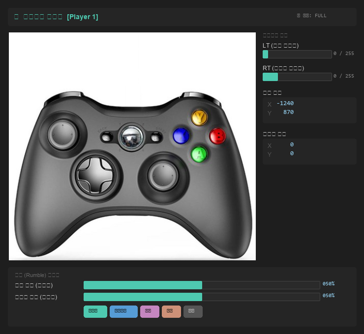

# Xbox 360 Controller Test (X360 Joystic)

Xbox 360 컨트롤러 입력을 실시간으로 시각화하는 WPF 데스크톱 앱입니다.  
Windows XInput API를 P/Invoke로 직접 호출하며 외부 NuGet 패키지 없이 동작합니다.

---

## 실행 화면



---

## 주요 기능

| 기능 | 설명 |
|---|---|
| 버튼 시각화 | A / B / X / Y, LB / RB, BACK / START, D-Pad 입력 시 컨트롤러 이미지 위에 오버레이 표시 |
| 아날로그 스틱 | 왼쪽·오른쪽 스틱 X/Y 값 실시간 표시, 이미지 위 점(dot)으로 위치 시각화 |
| 트리거 | LT / RT 값(0–255) 프로그레스바로 표시 |
| 진동(Rumble) 테스트 | 왼쪽/오른쪽/양쪽/교대 모터를 슬라이더로 세기 조절하며 테스트 |
| 배터리 표시 | 무선 컨트롤러의 배터리 잔량(EMPTY / LOW / MEDIUM / FULL) 표시 |
| 멀티플레이어 | Player 1–4 자동 감지 |
| 데드존 | 아날로그 스틱 데드존(±8000) 자동 적용 |

---

## 요구 사항

- Windows 8 이상 (`xinput1_4.dll` 기본 탑재)
- .NET 9.0 Runtime

---

## 빌드 & 실행

```bash
# 빌드
dotnet build X360Joystic/X360Joystic/X360Joystic.csproj

# 실행
dotnet run --project X360Joystic/X360Joystic/X360Joystic.csproj

# 릴리즈 빌드
dotnet build X360Joystic/X360Joystic/X360Joystic.csproj -c Release
```

---

## 아키텍처

```
X360_Joystic/
├── X360Joystic/X360Joystic/
│   ├── Program.cs                  # XInput P/Invoke 구조체 및 enum 정의
│   ├── MainWindow.xaml             # WPF UI 레이아웃
│   ├── MainWindow.xaml.cs          # 폴링 루프, 오버레이 업데이트, 진동 제어
│   └── ControllerOverlayLayout.cs  # 오버레이 좌표 레이아웃
├── img/                            # 컨트롤러 이미지 리소스
└── X360_Joystic.sln
```

**핵심 구조**

- **P/Invoke**: `xinput1_4.dll`에서 `XInputGetState`, `XInputSetState`, `XInputGetBatteryInformation` 직접 호출
- **폴링**: `DispatcherTimer` (~60 fps), `dwPacketNumber` 변경 시에만 UI 갱신
- **오버레이**: 버튼 입력에 따라 Canvas 위 Ellipse의 Fill/Opacity를 코드에서 직접 제어
